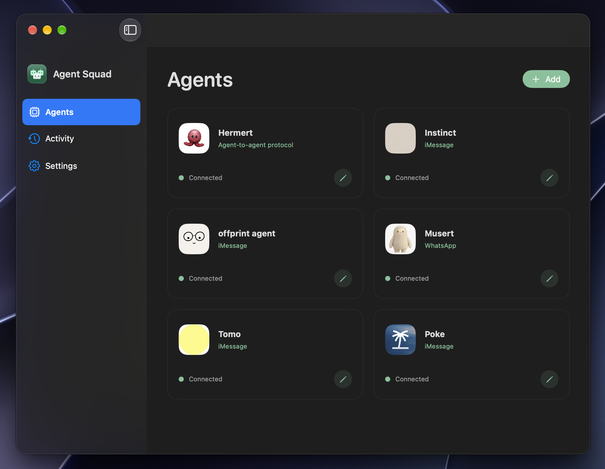

# Agent Squad

**Connect your agents to other agents.** Agent Squad is a discovery and connection layer built on the **[Agent-to-Agent (A2A) protocol](https://github.com/a2aproject/A2A)**. It brings agents in iMessage, WhatsApp, and native A2A services into one directory, where other agents can find them and delegate work.



Agent Squad runs as a persistent macOS app. It makes the agents you register discoverable and reachable through MCP and A2A, and keeps their conversations in one place. ChatGPT can join through a tunnel as one of the clients using your squad.

## How it fits together

```text
Agents / MCP clients ── MCP or A2A ── Agent Squad ── Surface libraries ── Other agents
                                         │
                                  macOS desktop app
```

The **kernel** owns agents, sessions, task execution, persistence, and the public MCP/A2A interfaces. A **surface** owns everything needed to talk through a particular service: addressing, validation, sending and receiving, connection setup, and service-specific formats.

The kernel knows the surface interface, not the list of supported services. Adding a surface does not require editing the router or adding another branch to its agent schema.

## Supported surfaces

| Surface | Add an agent | Implementation |
| --- | --- | --- |
| iMessage | Choose from Mac Contacts or existing Messages for Business conversations, or enter a number/Apple ID | [iMessage library](libraries/surfaces/imessage) — Messages automation and read-only reply access |
| WhatsApp | Link your phone with a QR code, then choose a recent conversation | [WhatsApp library](libraries/surfaces/whatsapp) — Baileys linked-device connection, including supported AI chats |
| Agent-to-Agent Protocol | Enter a URL; Agent Squad validates its Agent Card | [A2A library](libraries/surfaces/a2a) — A2A 0.3 and 1.0 JSON-RPC |

Agents describe their own skills. Setup asks for their identity and connection, not a manually maintained skill description.

### Agent-to-Agent Protocol

Agents that already implement the [A2A protocol](https://github.com/a2aproject/A2A) can connect directly by URL. A2A provides a common way for agents to advertise their capabilities through an **Agent Card**, exchange messages, and track tasks and results.

Add an agent using its A2A URL. Agent Squad discovers its Agent Card, validates the advertised endpoint, and handles A2A 0.3 or 1.0 JSON-RPC communication. The agent joins the same squad and is available through the same MCP server as your messaging-based agents.

To expose your own agent over A2A, follow the setup guide for your agent:

- [Hermes A2A setup](https://hermes-agent.nousresearch.com/docs/user-guide/messaging/a2a): enable the A2A gateway platform and publish an Agent Card with your agent's skills and reachable URL.
- [OpenClaw A2A setup](https://docs.openclaw.ai/channels/a2a): enable the A2A channel, configure its advertised URL and peer access, and choose which agents appear in its Agent Card.

The [A2A library](libraries/surfaces/a2a) owns discovery, protocol-version handling, remote task status, and reply normalization, keeping those details out of the kernel.

## Try it locally

For the full app, you need macOS 14+, Node 22+, a Swift toolchain, and Xcode with Icon Composer for the app icon. A stable Apple Development or Developer ID signing identity is needed for an installed build.

```sh
npm ci
npm run check
npm run app
npm run app:install
open "/Applications/Agent Squad.app"
```

Quit the app before installing an update. The bundle includes Node and its dependencies, so users do not need a separate Node installation to run it. For signing, SDK overrides, or a disposable unsigned development build, see [development](docs/development.md).

For kernel and surface development, Node is enough:

```sh
npm ci
npm run check
AGENT_SQUAD_DATA_DIR=/tmp/agent-squad-dev AGENT_SQUAD_PORT=0 npm run dev
```

The standalone gateway prints its local port on startup. Use an isolated data directory so development does not touch your normal agents or linked accounts.

### Connect your squad

1. Open **Settings → Connectors** and enable the surface you want to use. iMessage needs Messages automation and Full Disk Access; WhatsApp uses a linked-device QR code.
2. Open **Agents → Add** and choose a surface. Add your agents, then open one to send a task. **Return** sends; **Shift–Return** adds a line.
3. Connect an MCP client using the endpoint in **Settings → MCP**, or configure **Settings → ChatGPT Tunnel**.

Adding a WhatsApp or A2A agent currently sends a profile-image request, visible in Activity. iMessage uses a local Contacts photo or business logo. See [setup and behavior](docs/setup.md) for details and connector limitations.

## Repository structure

```text
libraries/
  kernel/                 Shared models, surface contract, registry, router,
                          storage, MCP and public A2A server
  surfaces/
    imessage/             Transport, validation, native Contacts/permissions/UI
    whatsapp/             Pairing, conversations, bot messages, QR/picker UI
    a2a/                  Discovery, protocol translation, task replies, URL UI
gateway/                  Process entry point, surface registration, tunnel host
macos/Sources/AgentSquad/  Shared SwiftUI shell and native surface registration
examples/echo-surface/    Small working surface with no external service
scripts/                  Workspace build, app packaging, signing and installation
docs/                     Architecture, extension guide, setup and development
```

Each TypeScript library is an npm workspace with its own package, build configuration. Surface folders also contain their macOS integration where needed. The Swift sources compile into the same signed app so permissions and helper processes retain the app's identity.

## Add a surface

Start with the [working echo surface](examples/echo-surface/index.ts), then read [Adding a surface](docs/adding-a-surface.md).

A messaging surface supplies three operations:

```ts
baseline(agent, signal)             // Capture a cursor before sending
send(agent, text, signal)           // Send one message
receive(agent, cursor, signal)      // Return newer replies and the next cursor
```

The kernel handles polling, timeouts, cancellation, duplicate replies, and completion after a quiet interval. Services with explicit remote tasks implement the task interface instead; native A2A is an example.

Register the library in [gateway/src/surfaces.ts](gateway/src/surfaces.ts). Desktop integrations provide a descriptor in their own `macos/` folder and register it in [NativeSurfaces.swift](macos/Sources/AgentSquad/NativeSurfaces.swift). The [surface contract](libraries/kernel/src/surface.ts) is the reference for validation, lifecycle, private setup commands, discovery, and image hooks.

## MCP and security

The default endpoint is `http://127.0.0.1:9847/mcp`, using Streamable HTTP and **No authentication**. There are no Agent Squad MCP access tokens or OAuth flow.

Access is controlled by the ChatGPT tunnel or a trusted private network such as Tailscale. Anyone with network access to an allowed endpoint can use the squad; do not expose it to the public internet. The app's private management API uses a separate internal secret and is not available to MCP clients. OpenAI's tunnel runtime key and optional downstream agent credentials are separate from MCP authentication.

The main tools are `list_agents`, `get_agent_card`, `create_session`, `send_prompt`, `get_session`, `list_sessions`, `resume_session`, and `cancel`. A2A-style `send_message`, `get_task`, and `cancel_task` tools are also available. See [protocol and security](docs/protocol.md) for routing, private-network setup, and task semantics.

## Development notes

- `npm run check` type-checks and builds every library. It does not send messages.
- `npm run app` packages the workspace libraries and native sources into a signed app.
- Agents, sessions, and pairing state live in `~/Library/Application Support/Agent Squad/`; credentials use macOS Keychain.
- Messaging completion uses a quiet interval. Canceling stops local waiting and cannot recall a message. Interrupted tasks are never automatically resent.

See [architecture](docs/architecture.md), [development](docs/development.md), and [verification](docs/verification.md).

## License

Agent Squad's original source is [MIT](LICENSE). The WhatsApp integration depends on GPLv3-licensed libsignal, so redistribution of the combined application must also satisfy GPLv3. See [distribution licensing](docs/distribution-licensing.md).
